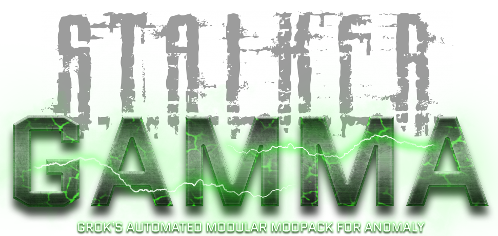

# ☢️ My Fedora Linux Stalker G.A.M.M.A. Setup

<p align="center">
  
</p>

**Quick Disclaimer:**
- This is not meant to be an educational guide of any sorts, this is simply the steps I use to get Stalker GAMMA up and running on a Fedora Linux installation.
- I use GNOME, this *should* work on KDE or other DE.
- Although this was written with Fedora in mind, it may work with other distributions as I'm using the Flatpak version of Bottles.

---

## Install Bottles

Enter into a terminal:

```
flatpak install flathub com.usebottles.bottles
sudo flatpak override com.usebottles.bottles --filesystem=host
```

## Install gamma-launcher

Here we are creating a directory where you will install GAMMA and gamma-launcher, Enter into terminal:

```
mkdir -p ~/Games/Stalker
cd ~/Games/Stalker
sudo dnf install libunrar
git clone https://github.com/Mord3rca/gamma-launcher
python3 -m venv env
source env/bin/activate
pip install --upgrade pip
cd gamma-launcher/
pip install .
gamma-launcher --version
```

## Install Stalker GAMMA

Here we are doing a full installation of Stalker GAMMA using gamma-launcher, Enter into terminal:

```
cd ~/Games/Stalker
gamma-launcher full-install --anomaly ./AnomalyGAMMA --gamma ./GAMMA --cache-directory ./cache
```

## Bottles Settings

Create a new 'Bottle' named GAMMA with the 'Gaming' preset, use the following settings:

- Runner:                   Latest ge-proton
- DXVK:                     Latest dxvk-gplasync
- VKD3D:                    Latest vk3d-proton
- Monitor Performance:      Enabled (If you use MangoHud)
- Feral GameMode:           Enabled
- Steam Runtime:            Disabled
- Dependencies:             d3dcompiler_46 d3dx11 d3dx9 dx8vb quartz vcredist2022
- Add Shortcuts...          ~/Games/Stalker/GAMMA/ModOrganizer.exe

## Mod Organizer 2 Setup

From your GAMMA Bottle, run the ModOrganizer shortcut:

- Press Next
- Create Portable Instance
- Browse to ~/Games/Stalker/AnomalyGAMMA
- Selected Location should now be GAMMA folder
- Press Next, Next, Finish!
- Ignore Error
- No, don't ask again to Tutorial

## (Optional) dxvk-gplasync Setup

This next section might be placebo, might not, all I can say is my game runs *very* smooth!

```
nano ~/Games/Stalker/AnomalyGAMMA/bin/dxvk.conf
```

Paste in the following, save and exit:

```
dxvk.enableAsync=true
dxvk.gplAsyncCache=true
RADV_PERFTEST=gpl
```

## Run the game & Enjoy!

Simply run ModOrganizer from within the GAMMA Bottle, select one of the Anomaly exe's from the dropdown and press Run (personally I use Anomaly (DX11-AVX))

## Purge Shader Cache

Should you ever need to purge your shader cache use the following:

```
cd ~/Games/Stalker
source env/bin/activate
gamma-launcher purge-shader-cache --anomaly ./AnomalyGAMMA
```

Thanks for reading!

